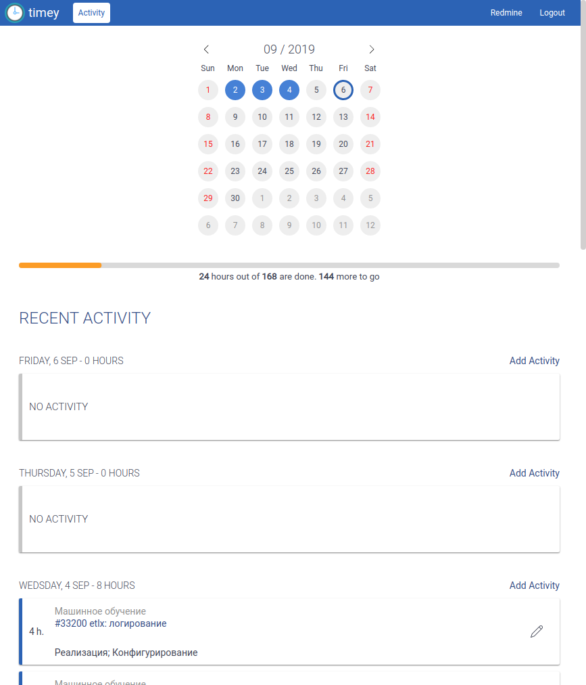

# Redmine Timey

Web application over Redmine API to simplify work with time entries.

Features:
* Github-like Activity Heatmap based on your time entries
* Monthly hours progress bar based on work calendar
* View \ Add \ Update \ Remove time entries



## Usage

### With Build Artifacts

```shell
$ node index.js start --redmine https://redmine.company.com
```

### With Docker

Environment variables:
* `REDMINE_HOST` - redmine instance address

```shell
$ docker run -p 8080:80 -e REDMINE_HOST=https://redmine.company.com nbatrakov/redmine-timey
```

## Start Options

> See `--help` for command line commands and options

Environment variables:
* `REDMINE_HOST` - Redmine host address
* `REDMINE_API_KEY` - Redmine API key
* `TIMEY_CERT_DIR` - Path to certificate directory with `pub.key` and `pub.cert` files. Enables HTTPS connection.
* `TIMEY_HTTP2_ENABLED` - Enables HTTP/2 support. HTTPS must be enabled too.

## Development

To run `npm start` you must set environment variable `REDMINE_HOST` to your redmine instance address.

For example (on linux):

```shell
$ export REDMINE_HOST=https://redmine.company.com
```

> You may also use [VS Code Integrated Terminal Environment Variables](http://serkanh.github.io/vscode,terminal,/2018/10/15/set-up-vscode-terminal-env-var.html)